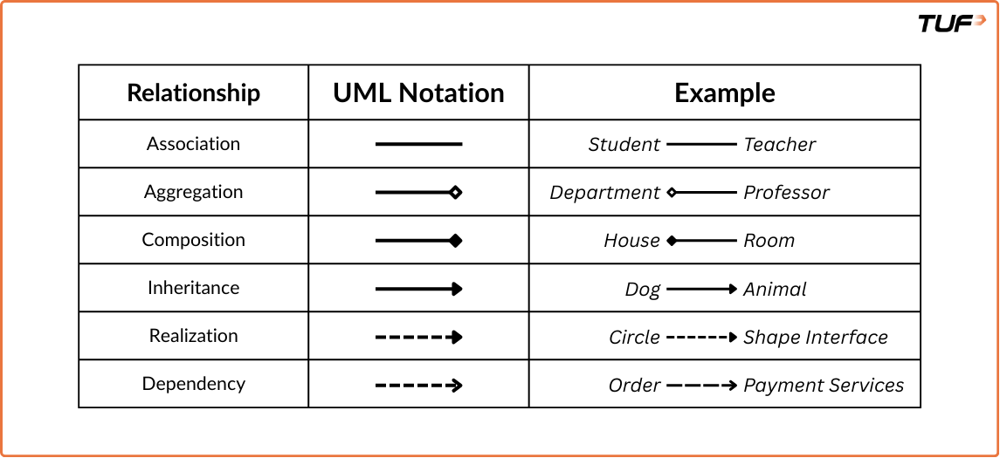

# Low Level Design

- Introduction: LLD is all about the small, detailed planning you do before actually building the house (or writing code).LLD is where your code starts to take shape. It's a crucial phase in the software development lifecycle that focuses on the detailed design of individual components or modules of a system.
- A simple example of LLD would be a basic Login System for a website, where LLD would involve forming different details components like: login(), signUp(), forgotPassword() along with their functionality.
- Key Characteristics of LLD:
  - Granular and Code-Level: LLD dives deep into the fine details of how each component will function.It defines classes, functions, variables, and data structures.
  - Implementation-Focused: LLD is directly linked to how the actual code will be written.It often includes pseudocode, flow diagrams, and sequence diagrams that show real-time data flow between functions.
  - Applies OOP Principles: LLD makes heavy use of Object-Oriented Programming (OOP) concepts like classes, inheritance, abstraction, encapsulation, and polymorphism.This helps build modular, reusable, and maintainable systems.For example, a base Notification class might have subclasses like EmailNotification and SMSNotification using inheritance and polymorphism.
  - `Note` that, in Low-Level Design (LLD), the stakeholders are primarily the people directly involved in the actual implementation of the system — Senior Software Developers, Technical Leads, Managers, etc.
- Software Design Principles:
  - `DRY` — Don't Repeat Yourself : This principle states that every piece of knowledge must have a single, unambiguous, authoritative representation within a system. In simple terms, avoid duplication of logic or code. Repeating code makes the system hard to maintain and error-prone. If a change is required, you might forget to update all occurrences.
  - `KISS` — Keep It Simple, Stupid : This principle states that simplicity should be a key goal in design and unnecessary complexity should be avoided. In simple terms, use the simplest possible solution that works. Avoid clever, convoluted code.
  - `YAGNI` — You Aren't Gonna Need It : This principle states that "Always implement things when you actually need them, never when you just foresee that you need them.". In simple terms, don't add functionality until it's necessary. Avoid building features that you think you might need in the future. This principle helps to keep the codebase clean and reduces unnecessary complexity.

## Solid Principles

There is a set of five principles for writing clean, scalable, maintainable object-oriented code. These principles are known as SOLID principles.`CHeck code examples in TUF+ Platform`

- The S in SOLID stands for Single Responsibility Principle.
- The O in SOLID stands for Open Closed Principle.
- The L in SOLID stands for Liskov Substitution Principle.
- The I in SOLID stands for Interface Segregation Principle.
- The D in SOLID stands for Dependency Inversion Principle.

- Single Responsibility Principle (SRP): A class should have only one reason to change. In other words, a class should only have one job, one responsibility, and one purpose.If a class takes more than one responsibility, it becomes coupled. This means that if one responsibility changes, the other responsibilities may also be affected, leading to a ripple effect of changes throughout the codebase.
- Open Closed Principle (OCP): As per OCP, Software entities (classes, modules, functions, etc.) should be open for extension, but closed for modification.This means that the behavior of a module can be extended without modifying its source code. The goal is to reduce the risk of breaking existing functionality when requirements change.
- Liskov Substitution Principle (LSP): If S is a subtype of T, then objects of type T may be replaced with objects of type S without altering the correctness of the program.This means that any subclass should be substitutable for its parent class without breaking the functionality.
  - There are some key principles to follow to avoid LSP violations. These are:
    - Subclasses should honor the contract (expectations) of the parent class.
    - Avoid overriding methods in a way that changes behavior drastically.
    - `Prefer` composition over inheritance when possible.
    - Think in terms of interfaces and behavioral compatibility.
    - Subclass should only extend, not restrict behavior.
- Interface Segregation Principle (ISP): "Don't force a class to depend on methods it does not use.".The Interface Segregation Principle is all about designing interfaces that are tailored to the needs of each client — just like Uber doesn't show driver options to passengers. This leads to modular, understandable, and future-proof code.
- Dependency Inversion Principle (DIP): High-level modules should not depend on low-level modules. Both should depend on abstractions. Abstractions should not depend on details. Details should depend on abstractions.
  - High-Level Modules: The parts of your code that contain the core logic — the brains of your application. They make big decisions and coordinate how different features work together.Example: CEO (makes decisions, plans strategies).
  - Low-Level Modules: The ones that handle the details — like talking to a database, making API calls, reading files, or providing data. They support the high-level logic by doing the grunt work.Example: Employees (do the actual implementation, logistics, and execution).

## UML - Unified Modeling Language

- UML (Unified Modeling Language) is a standardized modeling language used to visualize, specify, construct, and document the structure and behavior of software systems.It provides a set of graphic notation techniques to create abstract models of systems, covering both static and dynamic aspects.
- Think of UML as a toolkit of diagrams that helps software developers and designers map out how a system works, before or alongside writing the actual code. It's like planning a journey with a map — you get a clear picture of where everything is and how it all connects.
- UML diagrams are divided into two main categories, each serving a different purpose in modeling software systems:

1. Structural Diagrams - These describe the static structure of a system — what it contains, how different parts relate to each other, and how data is organized.

2. Behavioral Diagrams - These describe the dynamic behavior of a system — how it behaves over time, how users interact with it, and how parts communicate during execution.

- Different Structural Diagrams
  There are seven main types of structural diagrams in UML, each serving a specific purpose in modeling the static aspects of a system:
  `Class` Diagram: Shows classes, their properties, methods, and relationships — a map of the code structure.
  Object Diagram: Shows a snapshot of instances of classes and their relationships at a specific point in time.
  Component Diagram: Depicts how software components (modules) are organized and connected.
  Composite Structure Diagram: Shows the internal parts of a class and how they interact to carry out behavior.
  Deployment Diagram: Illustrates how software is physically deployed onto hardware devices or servers.
  Package Diagram: Groups related elements (like classes) into packages for better organization.
  Profile Diagram: Used to customize UML for specific platforms or domains by extending its elements.
- Different Behavioral Diagrams
  There are seven main types of behavioral diagrams in UML, each serving a specific purpose in modeling the dynamic aspects of a system:
  Use Case Diagram: Captures what users (actors) can do with the system — its high-level functionalities.
  Activity Diagram: Models workflows and business processes — similar to flowcharts.
  Sequence Diagram: Shows the order of messages exchanged between objects over time.
  Communication Diagram: Emphasizes interactions between objects and how they're connected.
  State Machine Diagram: Depicts how an object transitions between states based on events.
  Interaction Overview Diagram: Combines features of sequence and activity diagrams to model interaction flow.
  Timing Diagram: Focuses on object behavior with respect to time, particularly useful for real-time systems.

- `Note`: When diving into Low-Level Design, the focus is on the internal structure and detailed interaction of software components. While all UML diagrams have their place, the Class Diagram is considered the most important for mastering LLD. It provides a clear view of the classes, their attributes, methods, and relationships, making it essential for understanding how to design and implement software systems effectively.

### Class UML Diagrams - is what matters

A UML Class Diagram provides a high-level overview of the system architecture. It captures the system's classes, interfaces, enumerations, their attributes and operations (methods), and the relationships among them. It is instrumental in both forward and reverse engineering processes and is widely used in modeling object-oriented systems.

- Looking at a class diagram, you must quickly be able to understand the system's structure and how different components interact with each other. This is particularly useful for new team members or stakeholders who need to get up to speed with the system's design regardless of understanding the underlying code.
- `REFER Offline Notes`
- Relationship Between Classes:
  - Association (USE-A)
  - Aggregation (HAS-A)
  - Composition (Strong HAS-A)
  - Inheritance
  - Realization (Implementation)
  - Dependency
    

## Design Patterns

- Design patterns are a foundational concept in software engineering, especially when building scalable and maintainable systems.Design patterns are standard, time-tested solutions to common software design problems. They are not code templates but abstract descriptions or blueprints that help developers solve issues in code architecture and system design.
  - Design patterns help you avoid reinventing the wheel when facing recurring design challenges.
- The Three Categories of Design Patterns:
  - Creational Patterns
  - Structural Patterns
  - Behavioral Patterns

### Creational Design Pattern

- These focus on object creation mechanisms, trying to create objects in a manner suitable to the situation. They abstract the instantiation process, making the system independent of how its objects are created.

- Real-World Analogy: Imagine ordering a drink at a vending machine. You press a button (say “Orange Juice”), and the machine internally figures out how to prepare it — whether to pour from a bottle, mix a concentrate, or use a fresh dispenser. You don't care how it's made — you just get your drink.
- This is similar to the Factory Pattern, where the creation logic is hidden from the user and abstracted for flexibility.
- Examples include:
  - Singleton
  - Factory Method
  - Abstract Factory
  - Builder
  - Prototype

#### Singleton Pattern

- The Singleton Pattern ensures that a class has only one instance and provides a global point of access to that instance.

```Code
[Running] cd "c:\Users\abhis\Desktop\SoftwSysDesignArch\TUF_Plus\LLD\CreationalDesignPatterns\Singleton\" && javac Main.java && java Main
JudgeAnalytics@76ed5528
JudgeAnalytics@76ed5528

-- we can see both objects are same , because we are trying to return same object anyone who is trying to access that class methods.
```
