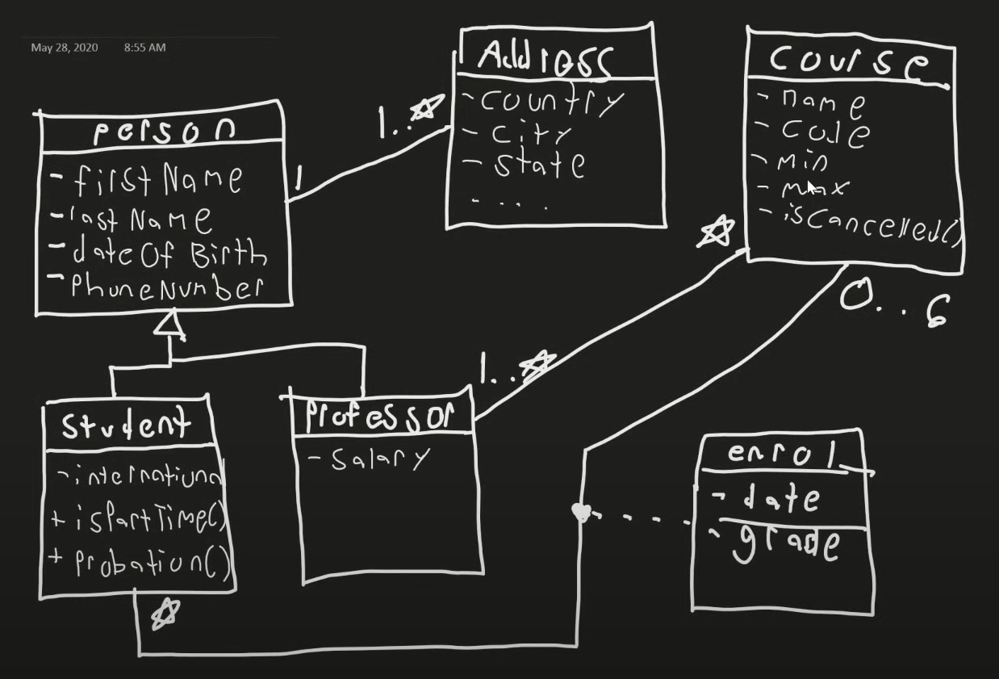

# Learning from techWithTim YT Channel

### Resources Info

- ## TechWithTimCollegeSystemDesign
- Software Design Tutorial #1 - Software Engineering & Software Architecture - [Video Link](https://youtu.be/FLtqAi7WNBY?si=8oITVx9oCWljk9o2)
  - Code Implementation for above design : [Software Design Tutorial #2 - Implementing Our Design](https://youtu.be/6thjSbJcoUc?si=N8S1EdxoDMUdOjrX)
  
